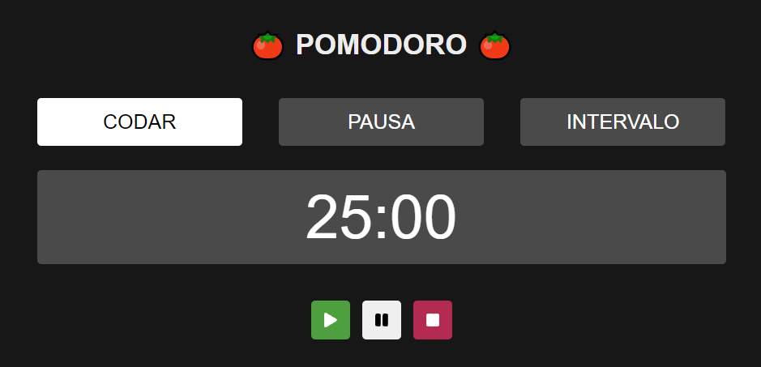

<div style="text-align: center">

</div>
### Criando um pomodoro utilizando ReactJS, Typescript e Styled-Components

#### Desafios enfrentados
- Gerenciamento de estado
- Utilização de Hooks (useState, useEffect)
- Formatação de dados
- Eventos e atribuições de classes
- Responsividade e adaptação em dispositivos móveis
- Subir a aplicação para o Vercel

Para acessar o projeto [Clique aqui](https://pomodoro-miluksandrades.vercel.app)

Para rodar o projeto:

Clone o repositório
```git clone https://github.com/miluksandrades/pomodoro-ts.git```

Instale as dependências
```yarn install```

Execute o projeto
```yarn dev```

Caso queira utilizar na versão mobile
```yarn dev --host```